# Repositorio clase DAWES

# Índice
- [Tema 1](#tema-1)
- [Tema 2](#tema-2)
- [Tema 3](#tema-3)
- [Tema 4](#tema-4)
- [Tema 5](#tema-5)

## Tema 1

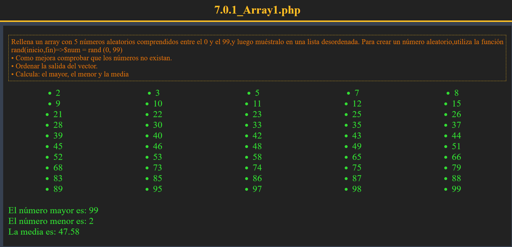
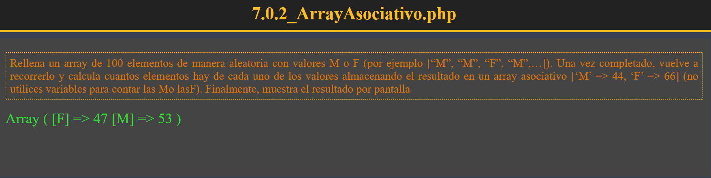
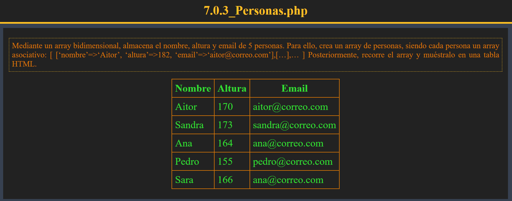
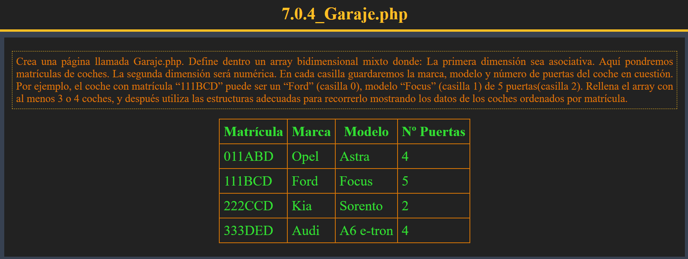
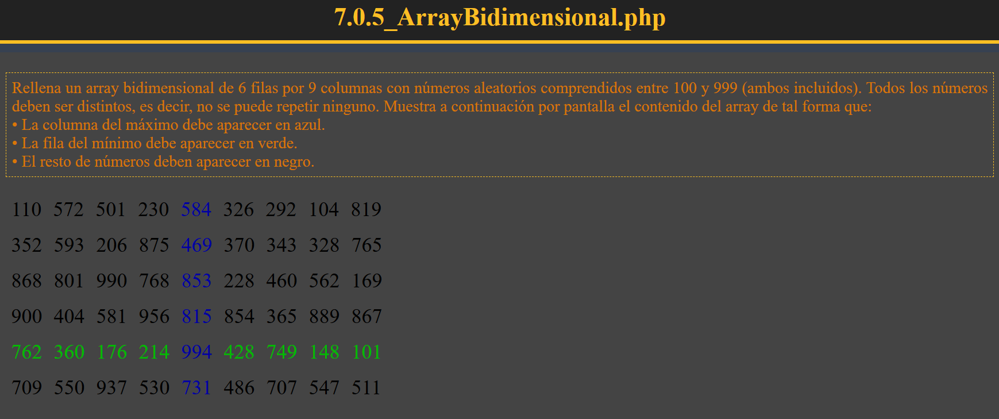

## Tema 2

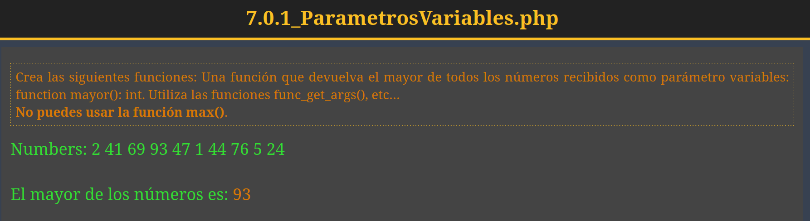
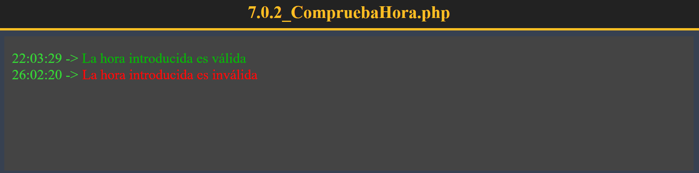
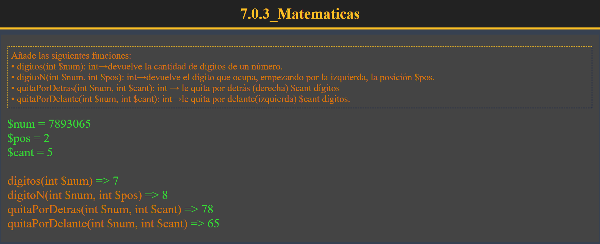
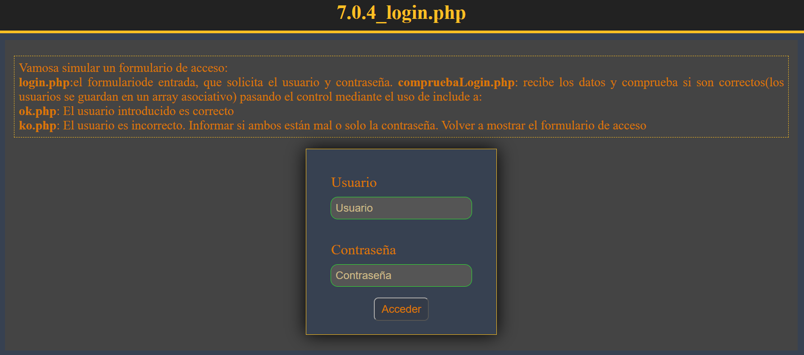
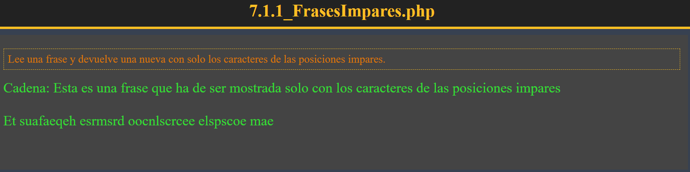
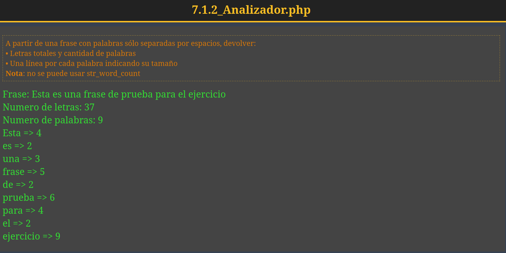
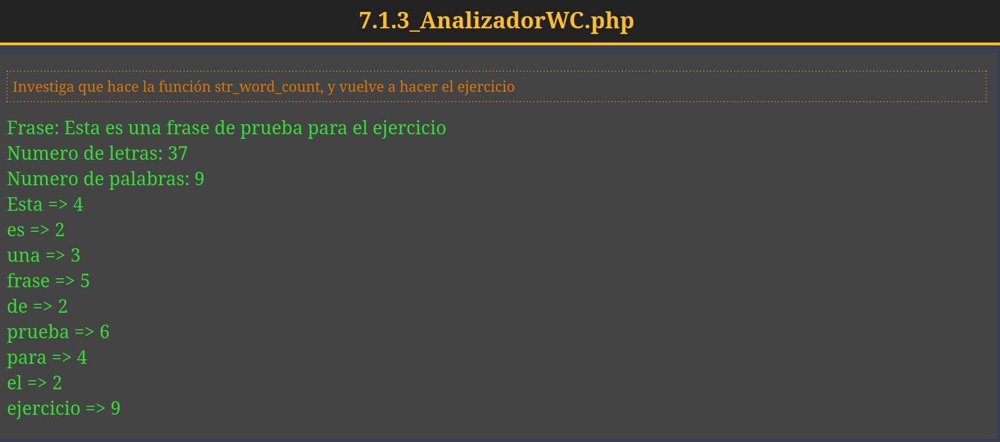
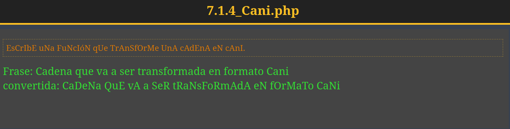
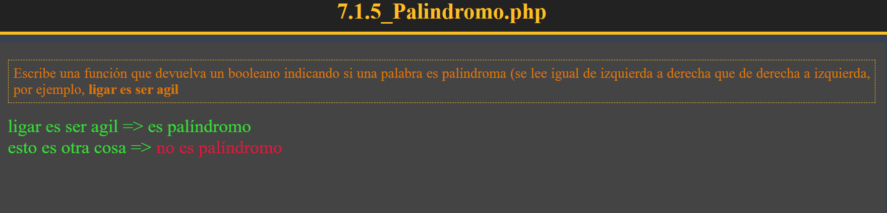
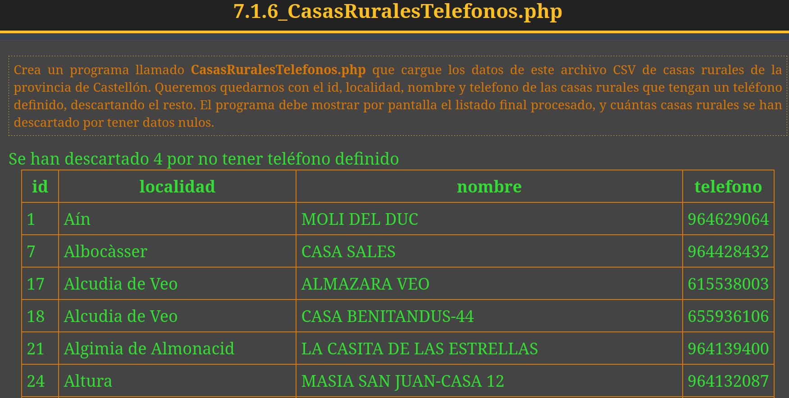
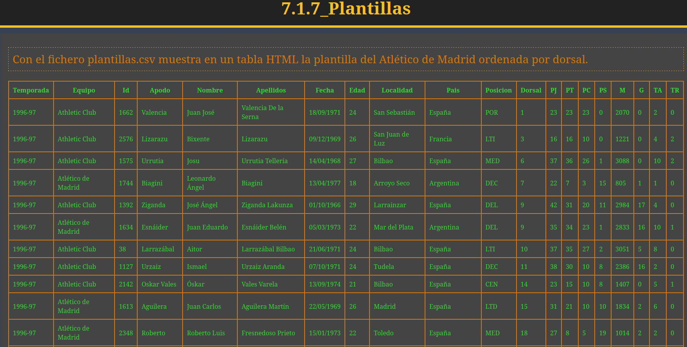

## Tema 3

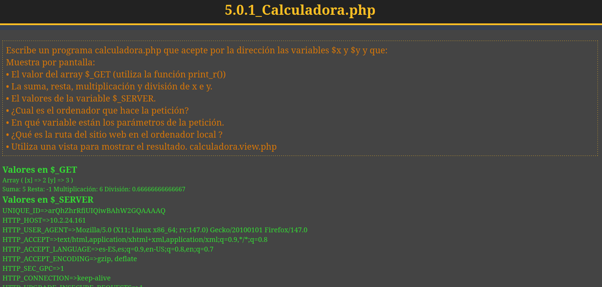
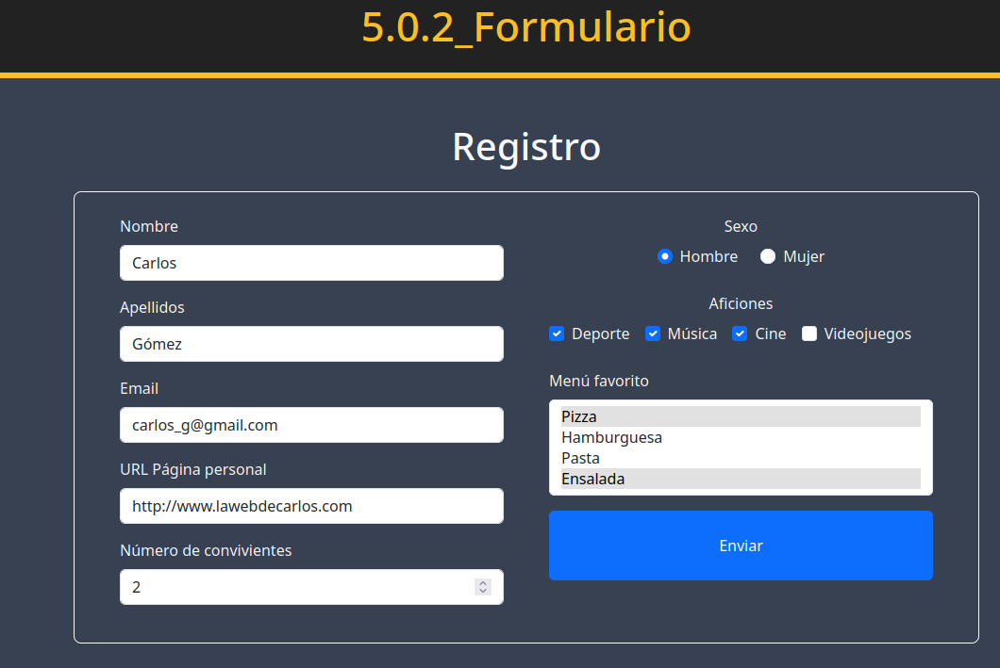

## Tema 4

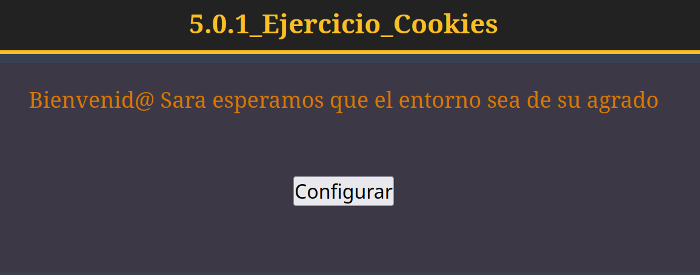
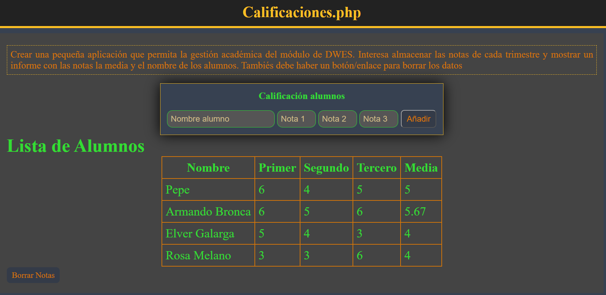

## Tema 5

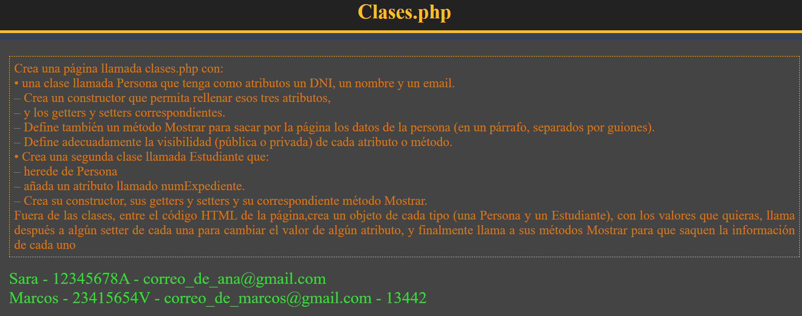

